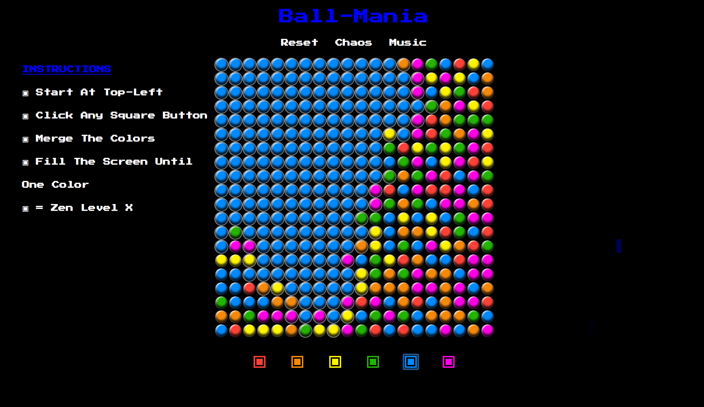

# wdi-project-1

**Introduction**

Based from the sort-of popular web version 'Drench', Ball-Mania is a signle player game and made for my first project on the Web Development course at General Assembly using JavaScript(JQuery) / CSS & HTML. 

A hosted version of my game can be found [here] (fierce-temple-20446.herokuapp.com) on Heroku ( check it out! ).

**How to play**

The player starts in the top-left corner of the grid and has to use the buttons on the bottom to join the adjacent colors in the grid to ultimately fill the screen in any color. 

It's rather theraputic.  

**Project Brief**

* Make a game

* Object-Orientated code

* Multiplayer (where possible)

**How it was built**

HTML, CSS and JavaScript with the aid of JQuery. 

Some of my snippets below from the project:

    const block = $('
', { id: [i], 'class': game.makeBlocks()});
 .
         
    if (game.invalidMove(newIndex, index)) continue;
        recursiveBlockCheck(newIndex);
      
         
.
      
    game.pastSides = function pastSides(newIndex, currentIndex) {
      return (newIndex % game.width) - (currentIndex % game.width) === game.width-1;

 
Overall I really enjoyed building the game and learnt a load along the way! I found the recursive logic of the game challenging at first though with the aid of my instructor it was overcome and grew an understanding from the challenge. 

**Further Objectives**

I would like to add a computer vs. mode as currently 'Chaos Mode' is just the computer randomly playing/overwriting colors to fill the board.
 

**Credits**

My General Assembly instructors

Jake Weary
